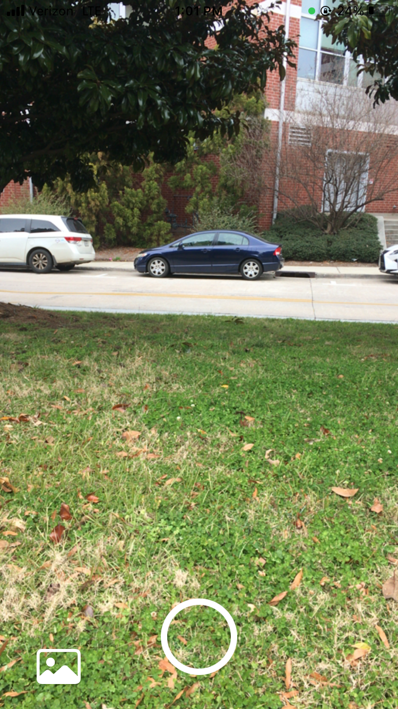
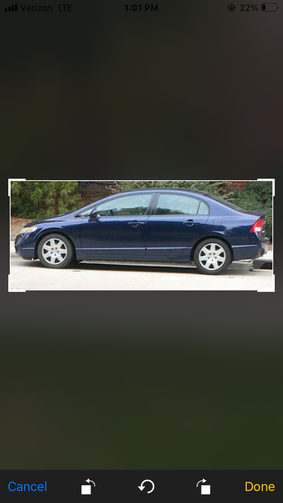
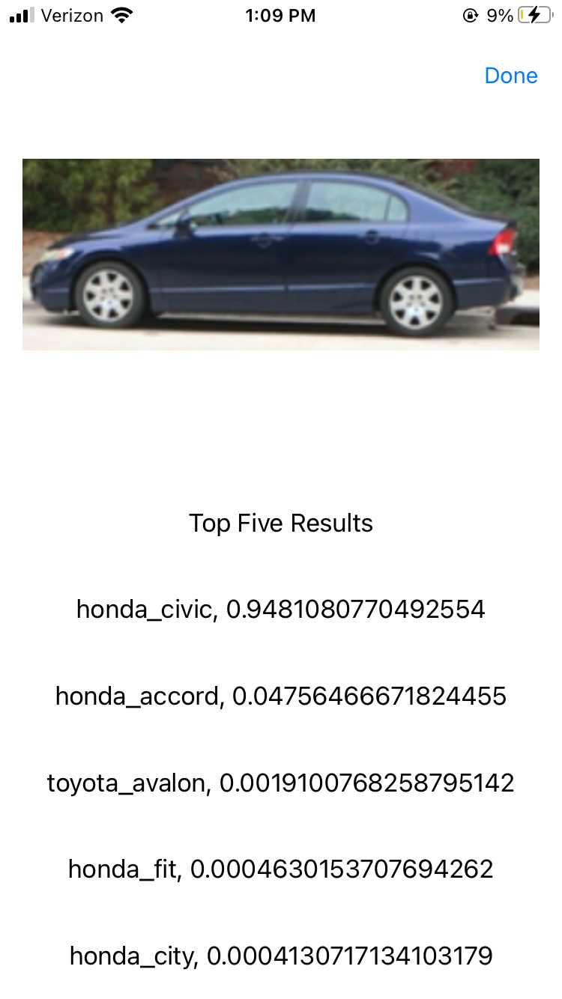

# car-classification-app
iOS app for classifying make and model of vehicles from images

# About
Uses a neural network to accurately classify images of cars by make and model. The current version only works for Hondas and Toyotas.

# Installation
Currently, the only way to use the app is to clone this repository in xcode then download onto a device.

# Usage
Take pictures of a car, or choose a picture from your library.

Then, crop the box around the car.

The app will then predict make and model of the car with confidence scores.

